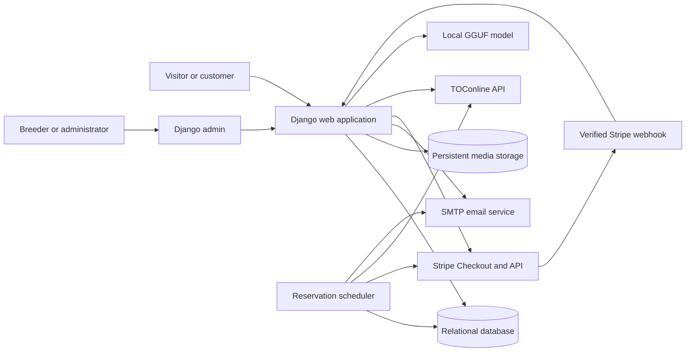
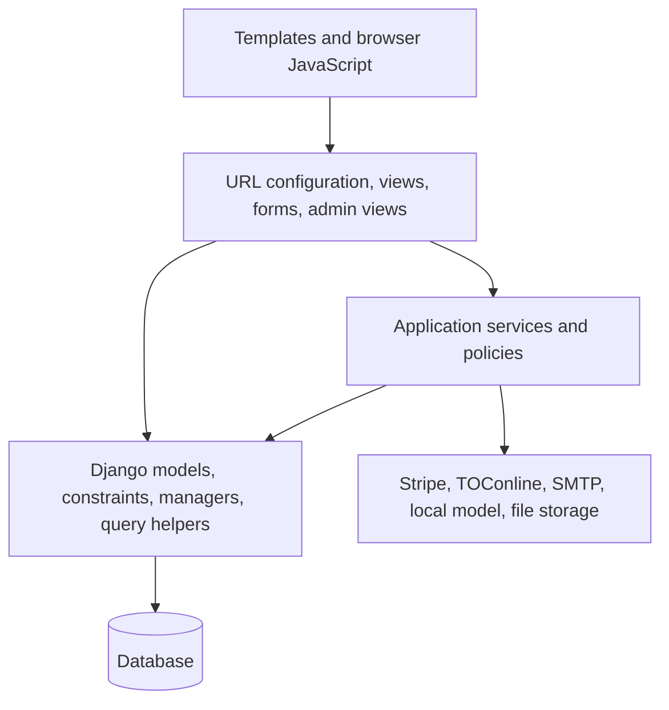
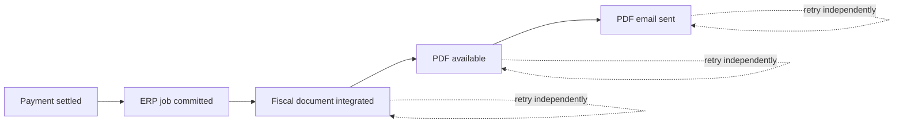

# Architecture

## Purpose

Fortissimus Bellator is a multilingual Django modular monolith for a
professional dog breeder. The same deployment serves:

- the public catalogue and editorial website;
- customer registration and self-service pages;
- the dog pre-reservation, reservation, and sale lifecycle;
- offline and Stripe payment recording;
- promotions, refunds, customer credit, and fiscal documents;
- litter birth alerts;
- a local, database-grounded sales chat;
- Django administration for all operational work.

The application deliberately keeps business processes in one database and one
codebase. There are no microservices and no frontend framework. This keeps
cross-domain transactions, auditing, deployment, and maintenance explicit.

## Technology stack

| Layer | Technology | Role |
| --- | --- | --- |
| Application | Python 3.13 and Django 6 | Routing, forms, templates, admin, ORM, transactions, authentication, email |
| Development database | SQLite | Low-friction local development |
| Container database | MariaDB 11.4 | Persistent relational storage |
| Recommended production database | PostgreSQL or a transactional SQL database with row locking | Correct `SELECT FOR UPDATE` behaviour for commercial concurrency |
| Frontend | Django templates, Tailwind CSS 4, small vanilla JavaScript modules | Server-rendered responsive interface |
| Static files | WhiteNoise manifest storage | Versioned static delivery |
| Media | Django file storage on a persistent filesystem | Dog, litter, breed, blog, and attachment media |
| Payments | Stripe Checkout and the official Stripe SDK | Hosted online payments and refunds |
| Accounting | `django-toconline` 2.x | TOConline sales documents, credit notes, and PDFs |
| Local AI | `llama-cpp-python` and one GGUF model | Bounded fallback for grounded chat answers and staff-reviewed aliases |
| Translation | Django i18n and `django-modeltranslation` | Interface and database-content translation |
| Process server | Gunicorn | Production WSGI |
| Packaging | Poetry and npm | Python lockfile and Tailwind/Leaflet assets |
| Containers | Multi-stage Dockerfile and Compose | Reproducible web, database, and scheduler services |

## Context diagram



Stripe, TOConline, email, and the local model are adapters around business
state. None of them is the authoritative source for whether a dog is available,
paid, reserved, or sold.

## Application boundaries

| Application/package | Responsibility |
| --- | --- |
| `fortissimusbellator` | Project settings, root URLs, shared templates, business contact constants, branded email, health checks, parsers, translation helpers, and secure upload endpoints |
| `frontoffice` | Homepage, about page, contact form, and FAQs |
| `breeding` | Animal kinds, breeds, certifications, dogs, litters, lineage, public catalogue, litter generation, and birth-alert subscriptions |
| `accounts` | Registration, account activation, profile, addresses, password flows, and general litter-alert settings |
| `reservations` | Sale cases, stage charges, pre-reservations, reservations, final sales, payments, refunds, credits, transfers, terms, ERP documents, dashboard, Stripe webhook, scheduler, and staff workflows |
| `discounts` | Promotion definition and deterministic promotion quotation |
| `chat` | Session-only chat HTTP API, intent/entity analysis, deterministic experts, public search projection, and local model lifecycle |
| `blog` | Categories, posts, related posts, comments, and generic likes |
| `quiz` | Breed-matching questions, weighted answers, and result calculation |
| `attachments` | Generic files, image/video metadata, ordering, and video thumbnails |
| `tags` | Generic translated tags and light/dark colours |
| `editorjs` | Structured blog editor field and admin widget support |

Application boundaries are ownership boundaries, not isolation barriers.
`reservations` references `breeding.Animal`, and `chat` reads public records from
several applications. Cross-application behaviour must still go through the
authoritative service or query module listed in [the documentation
index](README.md#system-ownership-at-a-glance).

## Architectural layers

The project uses pragmatic layers rather than a framework-independent domain
package:



### Presentation layer

Views and admin endpoints:

- parse and validate HTTP input;
- enforce authentication and object permissions;
- call one service operation;
- translate expected domain exceptions into useful messages;
- render templates or redirects.

Views must not independently decide availability, compute a refund, mutate a
financial state, or infer payment success from a redirect.

### Service layer

Service modules own multi-model use cases and transaction boundaries. Examples:

- `reservations/services/reservation.py` owns online stage transitions;
- `reservations/services/admin_workflows.py` owns staff-created stages and
  sales;
- `reservations/services/ledger.py` owns charges, adjustments, manual
  settlement, and credit allocation;
- `reservations/services/closures.py` owns cancellation value splits;
- `reservations/services/transfers.py` owns dog-to-dog workflow transfers;
- `reservations/services/payment.py` owns Stripe checkout, webhook
  reconciliation, and refunds;
- `reservations/services/erp.py` owns fiscal jobs and PDF retrieval;
- `breeding/services/litter_alerts.py` owns durable birth notifications;
- `discounts/services.py` owns promotion validation and calculation.

Commercial service operations use `transaction.atomic()` and row locks where
concurrent changes could allocate the same dog or money twice.

### Model and query layer

Models store durable facts, snapshots, and database constraints. Query helpers
define reusable read policies:

- `reservations/availability.py` is the sole dog availability policy;
- `chat/catalog.py` exposes only public records to chat;
- model managers define active, featured, for-sale, and published catalogues;
- `ChatSearchEntry` is a derived search projection, never a visibility
  authority.

Important invariants are duplicated only across a service validation and a
database constraint when the database is the required second line of defence.

### Adapter layer

External systems are accessed behind focused modules:

- `reservations/stripe_gateway.py` converts application operations to Stripe
  SDK calls;
- `reservations/services/erp.py` adapts typed `django-toconline` APIs;
- `fortissimusbellator/emails.py` builds and sends branded multipart email;
- `chat/runtime.py` composes one process-owned model and injects chat services;
- `chat/assistant.py` owns model download, checksum, loading, inference, and
  context fitting;
- Django storage abstractions own static and media paths.

Provider payloads and exceptions must not leak directly into customer pages.
Safe messages are shown to customers; detailed exceptions go to application
logs and durable retry records where applicable.

## Request topology

### Localized routes

Customer-facing pages and Django admin are inside `i18n_patterns`. URLs begin
with one of:

```text
/en/  /pt/  /es/  /fr/  /de/  /it/
```

The active language affects:

- interface translations;
- model-translated fields;
- email content;
- chat deterministic replies and model instructions;
- stored commercial language snapshots;
- birth-notification language.

### Non-localized routes

Machine endpoints and shared browser APIs remain outside language prefixes:

| Route | Reason |
| --- | --- |
| `/chat/message/` | Language is explicit in the validated JSON payload |
| `/chat/model-status/` | Legacy staff model-status bookmark |
| `/webhooks/stripe/` | Stable provider callback independent of locale |
| `/health/live/` | Infrastructure probe |
| `/health/ready/` | Infrastructure probe |
| `/upload/` | Staff upload API |
| `/editorjs/image/upload/file/` | Staff EditorJS upload API |
| `/editorjs/image/upload/url/` | Staff remote-image ingestion API |

Machine consumers must use these exact non-localized endpoints.

## Public rendering and frontend

The public site is server rendered from `fortissimusbellator/templates/base.html`.
The base template provides:

- language metadata and structured business data;
- skip navigation and a semantic main region;
- navigation, message, footer, WhatsApp, and scroll-to-top components;
- dark/light theme classes;
- a shared chat widget;
- page-specific blocks for styles, scripts, and chat context.

Tailwind is compiled from the root `styles.css` into
`assets/css/styles.css`. Page-specific CSS is used only where a focused custom
layout is clearer. Browser behaviour is split into small modules under
`assets/js/`:

| Module | Responsibility |
| --- | --- |
| `components/navbar.js` | Responsive navigation and theme controls |
| `components/messages.js` | Dismissible Django messages |
| `components/gallery.js` | Media gallery interaction |
| `components/paginated_loader.js` | Progressive “load more” partials |
| `components/scroll-top.js` | Scroll-to-top control |
| `components/chat.js` | Session-only chat controller |
| `pages/contact_us.js` | Contact-page behaviour |
| `pages/faqs.js` | FAQ interaction |
| `admin/chat_aliases.js` | Staff-only local-model alias suggestions |

The browser is never trusted for commercial price, availability, terms,
promotion, user identity, or payment confirmation. Every checkout POST is
revalidated on the server.

## Persistence strategy

### Current records and immutable snapshots

Public content such as a dog name or asking price can change. Historical
commercial records therefore store snapshots of:

- target name, breed, birth date, and deletion time;
- dog asking price, reservation percentage, and deposit target;
- customer identity and billing details;
- currency and language;
- promotion code, type, value, and calculated discount;
- exact accepted terms version and acceptance source;
- fiscal-document amount and currency.

Foreign keys remain where useful, but customer history does not depend on the
current public dog record.

### Financial ledger

`Charge` is the per-stage financial aggregate. Immutable child records explain
how it was settled:

- one or more `Payment` rows;
- signed `ChargeAdjustment` rows;
- `CreditAllocation` rows;
- `PaymentRefund` rows connected to payments.

Computed properties derive subtotal, promotion discount, adjustments, gross
payments, refunded value, credit, settlement, and outstanding balance. Do not
write a separate “paid total” field in a template or view.

### Derived projections

Some data is intentionally rebuildable:

- `ChatSearchEntry` is rebuilt from registered domain objects while preserving
  reviewed aliases;
- static files are rebuilt from source assets;
- generated thumbnails can be recreated from source media where practical.

Derived records must not become the sole owner of business truth.

## Background and deferred work

The project does not require Celery. One management command processes bounded
durable queues:

```bash
python manage.py process_reservation_workflows --limit 100
```

It handles:

- stale or expired Stripe checkout reconciliation;
- pending and retryable refunds;
- Stripe fee/net reconciliation;
- reservation-offer expiry;
- deferred and retryable ERP integration;
- ERP PDF retrieval and delivery;
- litter birth notifications.

The command is safe to run repeatedly because jobs use database states,
attempt counters, stable references, row locks, and provider idempotency. One
scheduler process per deployment is preferred to reduce contention and noise.

Model preparation uses one in-process background thread because it is local
runtime state, not durable business work. Django's `ChatConfig` instance owns
that state; mutable service instances are never stored as module globals.
WSGI/ASGI starts preparation during process boot, and the model stays resident
for the process lifetime.

## Integration consistency model

Payment, ERP, PDF, and email success are separate facts:



A failure on the right must never roll back or mislabel a successful fact on
the left. In particular:

- a successful Stripe payment remains paid if TOConline is unavailable;
- an integrated fiscal document remains integrated if its PDF download fails;
- a delivered commercial state remains valid if email delivery fails;
- a browser success redirect is not proof of payment;
- disabling TOConline defers work instead of inventing an accounting failure.

## Authentication and authorization

The site uses Django's built-in `User`:

- registration creates an inactive user;
- a signed activation token activates and logs in the user;
- login, logout, password reset, and password change use Django auth views;
- customer reservation and alert pages require authentication;
- Django admin and model controls require staff permissions;
- upload endpoints require an authenticated staff user;
- admin custom views repeat model-level change permission checks;
- customer document downloads verify ownership through the associated sale
  process.

Commercial staff actions must never be exposed by merely hiding a button.
Authorization is enforced in the view and service query.

## Security boundaries

### HTTP and browser security

Settings provide:

- HSTS;
- secure cookie and HTTPS redirect toggles;
- CSP and permissions policy;
- `X-Frame-Options`;
- strict-origin referrer policy;
- CSRF middleware and CSRF tokens;
- clickjacking and MIME-sniffing protection through Django middleware.

Production must set an unpredictable `SECRET_KEY`, explicit `ALLOWED_HOSTS`,
HTTPS, secure cookies, and trusted-proxy handling only behind a controlled
proxy.

### Payment security

- Card data is collected only by Stripe Checkout.
- The webhook verifies the raw payload with `STRIPE_WEBHOOK_SECRET`.
- Stripe event IDs are persisted for idempotency.
- Checkout metadata is validated against local payment, amount, currency, and
  purchase identifiers.
- Redirect pages reconcile server-side and do not trust query parameters.
- Refunds use stable idempotency keys per local refund record.

### Upload and outbound-request security

- General and EditorJS uploads are staff-only.
- File, chunk, image-byte, and pixel limits are configurable.
- Filenames and upload IDs are normalized.
- Remote images accept only public HTTP(S) addresses.
- Private, loopback, link-local, and unsafe redirect targets are rejected.
- Remote content is streamed with size and timeout limits.
- TOConline PDF download URLs are restricted to configured trusted hosts.

### Chat safety

- Messages, history, state, language, intent, and context are bounded and
  allow-listed.
- Public records are reloaded through public querysets.
- Deterministic experts answer catalogue and commercial facts.
- The local model receives only bounded published knowledge.
- The system prompt prohibits external facts and instruction replacement.
- Per-IP cache rate limiting protects the endpoint.
- Raw messages, history, and IP addresses are not written to operational logs.

See [Chat architecture](chat.md) for the complete threat and data-flow model.

## Observability

Current observability consists of:

- Gunicorn access logs;
- Django application logging to console;
- structured `key=value` chat route and model events;
- explicit logging for payment, ERP, email, upload, and scheduler failures;
- durable attempt/error fields on refunds, ERP documents, document emails, and
  litter notifications;
- liveness and database-readiness endpoints;
- staff filters and state badges in Django admin;
- business notifications for commercial states requiring attention.

Sensitive provider credentials, card data, passwords, raw chat messages, and
full webhook payloads must not be logged.

## Health model

| Endpoint | Meaning | Dependencies checked |
| --- | --- | --- |
| `/health/live/` | The process can serve Django requests | None |
| `/health/ready/` | The application can reach its primary database | `SELECT 1` |

Stripe, TOConline, SMTP, and the local model are intentionally not readiness
dependencies. Their failure degrades an optional or retryable capability and
must not remove healthy catalogue pages from service.

## Core design invariants

1. One active sale case may hold a dog at a time.
2. A non-voided `AnimalSale` is the final public availability authority.
3. Dog availability is computed through `reservations/availability.py`.
4. Litters are informational and support alerts; they are not purchasable.
5. A payment redirect never confirms payment.
6. Money already committed is represented by immutable ledger records.
7. Refund, credit, and retained value must exactly partition the value closed
   or transferred.
8. External integration failure never rewrites confirmed local financial
   state.
9. Historical customer and target snapshots survive public deactivation or
   deletion.
10. Terms acceptance always points to the exact published version and records
    who accepted it.
11. Chat may describe only current public database facts.
12. Background work is bounded, retryable, observable, and idempotent.

The detailed enforcement points are documented in [Domain
model](domain-model.md) and [Commercial workflows](commercial-workflows.md).
