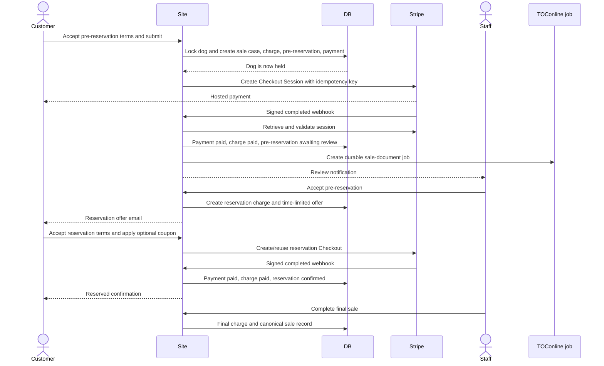
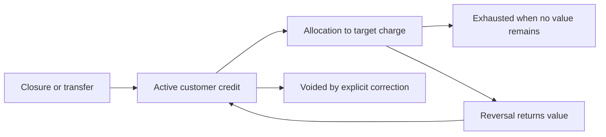
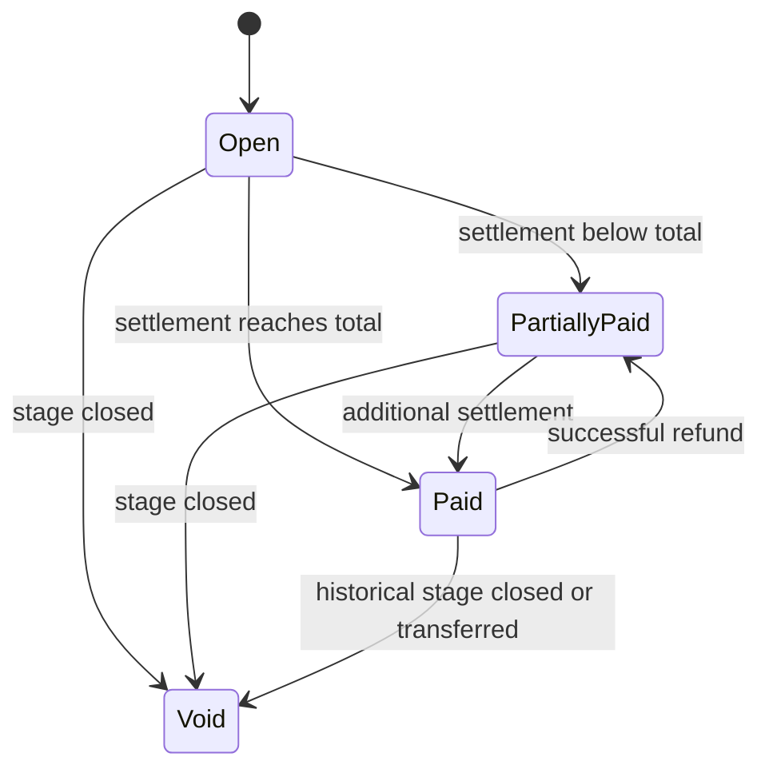
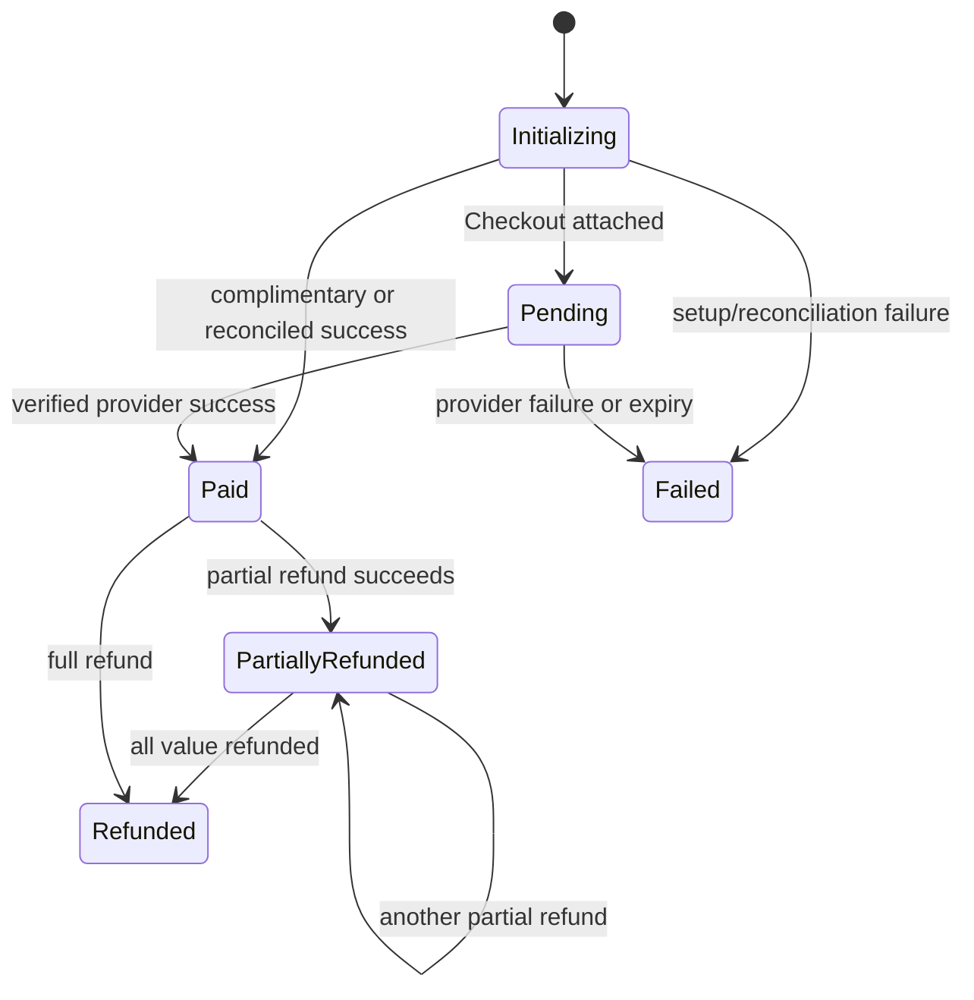

# Commercial workflows

## Scope

This is the authoritative functional reference for:

- dog availability;
- online and staff-created pre-reservations;
- reservation offers and deposits;
- direct reservations and direct sales;
- charges, payments, adjustments, and promotions;
- cancellation, rejection, expiry, refunds, and retained value;
- customer credit;
- transfer to another dog;
- final sale;
- Stripe and TOConline consistency;
- customer and business notifications.

Implementation details are split across `reservations/services/`. Do not change
a status directly to bypass the service that owns its transition.

## Vocabulary and separate state machines

Several records describe one process from different perspectives:

| Record | Question it answers |
| --- | --- |
| `AnimalSaleCase` | What business stage is this customer/dog process in? |
| `PreReservation` | What happened in the initial paid application and breeder review? |
| `Reservation` | Was a reservation offered, paid, confirmed, expired, cancelled, or transferred? |
| `Charge` | What amount is due for this stage and how much is settled? |
| `Payment` | What happened to one Stripe or offline payment attempt? |
| `PaymentRefund` | What happened to one explicit refund instruction? |
| `WorkflowClosure` | How was available value split when a process closed? |
| `CustomerCredit` | What value remains available for this customer later? |
| `AnimalWorkflowTransfer` | How did value and stage move from one dog to another? |
| `AnimalSale` | What final price/date completed the sale? |
| `ERPDocument` | Has the fiscal document or credit note been integrated and downloaded? |

These states must not be collapsed into one field. For example:

- a reservation may be confirmed while its fiscal PDF is temporarily failed;
- a payment may be paid while the sale case is still awaiting breeder review;
- a process may be cancelled while its refund is still pending;
- an ERP document may be deferred while the commercial workflow is complete.

## Sources of truth

| Decision | Source of truth |
| --- | --- |
| Dog sold | non-voided `AnimalSale` |
| Dog currently held | active `AnimalSaleCase`, with legacy stage fallback |
| Public availability reason | `reservations/availability.py` |
| Current commercial stage | `AnimalSaleCase.status` and its stage record |
| Stage amount | `Charge` and its immutable children |
| Stripe success | verified/retrieved Stripe object reconciled into `Payment` |
| Terms accepted | exact terms FK, source, and acceptance timestamp |
| Final sale price | `AnimalSale.final_price` |
| Refund committed | `PaymentRefund` in pending, processing, or succeeded |
| Customer credit available | `CustomerCredit` minus active allocations |
| Fiscal integration | `ERPDocument.status` |
| Fiscal PDF available | `ERPDocument.pdf_status` and private `pdf_data` |

Templates, redirects, emails, chat replies, and admin badges only present these
facts.

## Dog eligibility

### Online pre-reservation

A dog can start online pre-reservation only when all conditions are true:

| Condition | Reason |
| --- | --- |
| `active=True` | The dog is publicly managed |
| `for_sale=True` | The dog is in the sales catalogue |
| No non-voided `AnimalSale` | Final sale overrides every earlier stage |
| `pre_reservation_enabled=True` | Staff explicitly allows online pre-reservation |
| Published current price is positive | Deposit and customer disclosure can be calculated |
| No active blocking sale case | One customer at a time |
| Current pre-reservation terms exist | Acceptance must be versioned |
| Customer is authenticated | Dashboard, ownership, and online payment require identity |

### Staff-created processes

Staff may start:

- a pre-reservation;
- a direct reservation;
- a direct final sale.

The dog must still be active, for sale, unsold, and not held by another active
sale case. Staff may override the stage amount and may work with an unregistered
customer for offline settlement. Online Stripe settlement requires a
registered user.

Staff workflows use inventory availability, not online pre-reservation
eligibility. This permits a direct reservation for a dog whose online
pre-reservation switch is disabled, or whose public price is on request, as
long as staff enters the commercial amount.

Dogs held by an active pre-reservation or reservation, and dogs with a
completed non-voided sale, are omitted from every new-process and transfer
target selector. A stale or forged admin submission is still rejected by the
transactional service and database constraint. Rejection never cancels,
transfers, or changes the existing customer's process. Staff must explicitly
cancel the existing process, or use the dedicated same-customer transfer
workflow to move that process to another available dog.

## Inventory blocking

### Pre-reservation states

| `PreReservation.status` | Holds dog? | Meaning and next action |
| --- | --- | --- |
| `pending_payment` | Yes | Checkout is being created or remains open |
| `awaiting_review` | Yes | Paid; breeder review has no deadline |
| `accepted` | Yes | Breeder accepted; a reservation offer exists |
| `not_accepted` | No | Staff rejected the application |
| `payment_failed` | No | Initial payment failed; same record may be retried |
| `expired` | No | Initial Checkout expired; same record may be retried |
| `cancelled_by_user` | No | Customer cancelled before acceptance |
| `cancelled_by_admin` | No | Staff cancelled |
| `reservation_offer_expired` | No | Accepted customer missed reservation deadline |
| `converted_to_reservation` | No by itself | Confirmed reservation is the blocker |
| `transferred` | No | Source moved to another dog |

### Reservation states

| `Reservation.status` | Holds dog? | Meaning and next action |
| --- | --- | --- |
| `offered` | Yes | Breeder/staff offer exists; customer has not started payment |
| `pending_payment` | Yes | Terms accepted and Checkout is active |
| `payment_failed` | Yes | Attempt failed, but the accepted offer remains until deadline |
| `confirmed` | Yes | Deposit target is settled; public label is Reserved |
| `expired` | No | Deadline passed |
| `cancelled_by_admin` | No | Staff closed the reservation |
| `transferred` | No | Source moved to another dog |

The key asymmetry is deliberate:

- failure before breeder acceptance releases the dog;
- failure after breeder acceptance does not release it immediately, because
  the accepted reservation offer remains valid until `offer_expires_at`.

### Database concurrency defence

The application prevents two customers from acquiring the same dog with:

1. a transaction around creation/reopening;
2. `SELECT FOR UPDATE` on the dog and relevant workflow records;
3. an active-sale-case unique constraint on the dog;
4. a legacy active-pre-reservation unique constraint;
5. Stripe Checkout creation only after local holding records commit;
6. availability revalidation on retries and every stage transition.

PostgreSQL or another production database with real row locks is preferred.
SQLite is suitable for development but does not provide equivalent concurrent
write semantics.

## Public labels

The site renders one label:

```text
Sold > Reserved > Pre-reserved > Available
```

| Public label | Durable condition |
| --- | --- |
| Sold | non-voided `AnimalSale` exists |
| Reserved | Confirmed reservation exists |
| Pre-reserved | Another active sale case holds the dog |
| Available | None of the above and inventory eligibility passes |

An offered direct reservation appears as Pre-reserved until its deposit is
confirmed. `for_sale` remains true while a dog is held; it is not a substitute
for availability state.

## Online happy path



TOConline processing occurs after the local payment transaction. Its failure
does not alter the commercial state.

## Online pre-reservation in detail

### Checkout display

The page loads:

- current dog and cover;
- fee or staff-overridden retry subtotal;
- current terms;
- customer profile defaults;
- optional promotion preview;
- discount and final amount;
- non-refundable warning.

The “Apply coupon” action only previews a quote. The final submit revalidates
the code inside the locked transaction.

### Local hold before Stripe

The service creates, in this order within one transaction:

1. `AnimalSaleCase(status=pre_reservation)`;
2. `Charge(stage=pre_reservation)`;
3. `PreReservation(status=pending_payment)`;
4. `Payment(status=initializing, provider=stripe)`.

Only then does the application call Stripe. This is mandatory: a remote
Checkout must never exist without a local hold, and another customer must see
the dog as unavailable while the first customer is paying.

The Stripe Checkout expires after `RESERVATION_CHECKOUT_MINUTES`. The local
pre-reservation hold includes an additional ten-minute reconciliation margin
so delayed provider events can be checked before cleanup.

### Zero-value checkout

A 100% promotion can reduce the pre-reservation charge to zero. The service:

- creates a complimentary paid payment;
- marks the charge paid;
- moves directly to `awaiting_review`;
- sends normal paid/review notifications;
- does not call Stripe;
- does not create a sale ERP document for zero real-payment value.

### Stripe setup failure

If configuration or Checkout creation fails before a usable session:

- pre-reservation becomes `payment_failed`;
- payment becomes `failed`;
- sale case closes;
- charge is voided;
- the dog is immediately available;
- the customer can retry the same pre-reservation record.

### Browser cancellation

Returning through Stripe's `cancel_url` does not itself prove failure. The page
shows a cancelled/interrupted payment state and offers dashboard/retry actions.
The webhook, explicit Stripe retrieval, or scheduler establishes whether the
session actually failed, expired, or paid.

### Provider failure or expiry

For initial pre-reservation checkout:

- `checkout.session.async_payment_failed` produces `payment_failed`;
- `checkout.session.expired` produces `expired`;
- the payment becomes failed;
- the charge is voided;
- the sale case closes;
- the dog is released;
- a state email is sent;
- retry reuses the same sale case, stage, charge, and payment.

### Retry without visual pollution

The retry URL identifies the existing UUID. Reopening:

- verifies ownership;
- locks and revalidates the dog;
- requires the current terms again;
- recalculates current online values unless the process was staff-created;
- revalidates the promotion and usage limits;
- reopens sale case and charge;
- clears earlier failure fields;
- increments `checkout_attempt_number`;
- resets Stripe identifiers;
- creates a new idempotent Checkout attempt.

The customer sees one commercial process with technical payment attempts,
rather than ten duplicate pre-reservation cards.

### Payment confirmation

Payment is confirmed only after the application:

1. verifies the Stripe webhook signature or retrieves the session server-side;
2. resolves the local payment from metadata;
3. verifies purchase UUID, payment ID, attempt number, amount, currency, and
   paid status;
4. locks the payment and workflow;
5. ignores already settled repeats;
6. records provider identifiers and paid timestamp;
7. refreshes the charge;
8. moves the pre-reservation to `awaiting_review`;
9. clears its checkout hold;
10. creates a durable ERP sale-document job when real money was received;
11. schedules customer/business notifications after commit.

`ProcessedStripeEvent` makes repeated webhooks harmless.

## Breeder review

### Waiting

`awaiting_review` has no automatic deadline. The breeder may need to contact
and assess a customer before accepting. The dog remains held for that entire
period.

### Accept

Staff can accept only a fully settled pre-reservation awaiting review. The
service verifies:

- no pending refund;
- dog still exists, is active, for sale, unsold, and enabled;
- public price and deposit percentage still match paid snapshots;
- no competing hold exists;
- current reservation terms are published.

Acceptance:

- marks pre-reservation `accepted`;
- records reviewer, time, and optional note;
- creates a reservation-stage charge;
- creates `Reservation(status=offered)`;
- credits retained pre-reservation settled value toward the deposit target;
- sets `offer_expires_at` from `Animal.reservation_offer_hours`;
- moves the sale case to reservation;
- sends the reservation-offer email.

The configured duration defaults to 72 hours and must be between 1 and 168
hours.

### Reject

Rejection:

- is only available from `awaiting_review`;
- records reason, reviewer, and closure timestamps;
- sets `not_accepted`;
- closes the sale case;
- releases the dog;
- requires staff to explicitly decide refund, customer credit, and retained
  value in the admin workflow;
- sends a customer and business state email.

The pre-reservation fee is non-refundable by nature. No refund is the default;
staff may make an explicit discretionary exception.

## Reservation offer and deposit

### Amount calculation

For an accepted online pre-reservation:

```text
deposit target = snapshotted dog price * deposit percentage
pre-reservation credit = min(pre-reservation settled value, deposit target)
amount before reservation promotion =
    deposit target
    - pre-reservation credit
    - allocated customer credit
reservation payment =
    amount before promotion
    - reservation promotion discount
```

The pre-reservation payment is therefore part of the deposit target, not an
extra amount added to the dog price.

### Customer checkout

The customer must:

- own the sale case;
- act before `offer_expires_at`;
- accept the current reservation terms;
- use a promotion applicable to the reservation stage, if any.

Starting payment moves `offered` to `pending_payment`. Zero remaining value
moves directly to `confirmed` with a complimentary payment.

### Failed reservation payment

A failed reservation payment:

- sets `Reservation.status=payment_failed`;
- sets the payment failed;
- keeps the sale case active;
- keeps the dog held;
- permits retry while the original offer deadline remains in the future.

Retry reuses the reservation and payment, increments the attempt, and does not
extend the offer deadline.

### Offer expiry

The scheduler or a checkout request expires an unpaid `offered`,
`pending_payment`, or `payment_failed` reservation after its deadline:

- reservation becomes `expired`;
- source pre-reservation becomes `reservation_offer_expired`;
- pending payment becomes failed;
- sale case closes;
- reservation charge is voided;
- dog is immediately released;
- customer receives an expiry email;
- the customer must begin a new pre-reservation if the dog remains available.

There is no automatic refund on expiry. The retained pre-reservation value
remains historical under the accepted terms. Staff can make a separate,
explicit refund decision if business circumstances justify it.

### Confirmed reservation

Successful settlement:

- confirms payment and charge;
- changes reservation to `confirmed`;
- changes source pre-reservation to `converted_to_reservation`;
- keeps sale case in reservation;
- changes the public label to Reserved;
- creates the ERP sale-document job for real reservation-stage payment;
- sends confirmation.

The customer cannot cancel a confirmed reservation online.

## Staff-created workflows

### Admin entry point

Open:

```text
Administration > Reservations > Animal sale processes > Add
```

The form records the real starting stage rather than manufacturing earlier
records. Select the dog, registered customer when online payment is required,
customer and billing snapshots, exact commercial amount, settlement method,
and terms handling.

| Selection | Immediate result | Customer next action |
| --- | --- | --- |
| Pre-reservation + Stripe | `pending_payment`; dog is Pre-reserved | Accept pre-reservation terms and pay the same process |
| Pre-reservation + received offline payment | Pre-reservation auto-accepted; reservation `offered` | Accept reservation terms and settle the deposit |
| Pre-reservation + complimentary zero value | Audited zero payment; pre-reservation auto-accepted; reservation `offered` | Accept reservation terms and settle any reservation amount |
| Direct reservation + Stripe | Reservation `offered`; dog is Pre-reserved | Accept reservation terms and settle before the deadline |
| Direct reservation + received offline payment | Reservation `confirmed`; dog is Reserved | No online payment |
| Direct reservation + complimentary zero value | Audited zero payment; reservation `confirmed`; dog is Reserved | No online payment |
| Direct final sale + offline/credit/complimentary settlement | Sale recorded; dog is Sold | No online payment |

For cash, bank transfer, card terminal, or `Other`, the admin is asserting that
the value was genuinely received outside Stripe. `Other` requires an
explanation and covers documented real-world settlement such as an agreed
exchange. To grant a stage for free, enter zero, select the complimentary
option, and explain the decision. To preserve a non-zero original charge while
waiving or changing it later, use the immutable charge adjustment action.

After creation, the sale-process page links directly to every stage charge and
specialised record. From the charge page staff can:

- record a partial or full verified offline payment;
- replace an unstarted or safely closed Stripe attempt with an offline payment;
- add a signed discount, waiver, surcharge, or correction;
- record current terms accepted outside the website when required.

Settlement synchronisation is atomic with the manual payment or adjustment.
If validation fails, the financial entry is not partially applied.

### Decision table

| Real-world situation | Admin start stage | Required settlement handling |
| --- | --- | --- |
| Customer applies/payments starts at kennel | Pre-reservation | Offline payment with in-person terms, or Stripe for registered customer |
| Breeder skips pre-reservation and accepts customer directly | Direct reservation | Offline settlement, customer credit, or online offer |
| Dog is fully sold in person | Direct final sale | Offline final payment and sale date |
| Existing active process reaches final sale | Complete sale | Earlier settled value plus final balance |
| Existing active process changes dog | Transfer | Exact transfer/refund/retained split and target difference |

### Staff pre-reservation

Staff chooses:

- dog;
- registered user or customer snapshots;
- exact pre-reservation amount;
- terms accepted in person or pending online acceptance;
- Stripe, a verified offline provider, or an explicit complimentary outcome.

For offline payment, current terms must have been accepted in person. For
Stripe, a registered customer is required and the dashboard routes the same
record into online acceptance/payment. The customer and business recipients
receive a branded payment-request email with a link to that same record.

Creating the process in the admin is itself the breeder decision. Therefore:

- an offline-paid or complimentary staff pre-reservation is accepted
  automatically and immediately creates the reservation offer;
- a Stripe staff pre-reservation remains `pending_payment` until the customer
  accepts the current terms and payment is confirmed;
- after that Stripe payment, it is accepted automatically and creates the
  reservation offer;
- if automatic acceptance is temporarily blocked after a real Stripe payment,
  the payment remains safely confirmed and the pre-reservation remains
  `awaiting_review` for manual recovery.

The indefinite `awaiting_review` state remains the normal path for
customer-created online pre-reservations because the breeder has not yet
approved that customer.

### Direct staff reservation

Staff may create a reservation without a synthetic pre-reservation. The exact
deposit amount may differ from the dog's configured percentage.

Options:

- record in-person terms and an offline payment, immediately confirming the
  reservation;
- apply eligible existing customer credit;
- create a Stripe offer for a registered customer to accept/pay online.

For a Stripe direct reservation, the offer deadline is 1 to 168 hours. Until it
is confirmed, the public lifecycle remains Pre-reserved. The customer and
business recipients receive a branded invitation containing the deadline and
the direct checkout link.

### Direct final sale

A direct final sale:

- requires exact final price and sale date;
- may use cash, bank transfer, card terminal, other provider, and customer
  credit;
- cannot leave Stripe payment outstanding;
- creates sale case, final-stage charge, payment/credit, and `AnimalSale`;
- records the customer on the sale case without duplicating it on `Animal`;
- changes the sole public lifecycle label to Sold.

If the customer still needs to pay online, staff must create a reservation
instead of pretending a final sale is settled.

### Manual payments

Staff may record a verified positive offline payment against an open charge.
Each record includes provider, amount, external reference, note, recorder, and
paid time.

Manual payment must represent money actually received. It is not a shortcut for
waiving a balance. Use a negative adjustment or customer credit for that.
When the original process expected online terms acceptance, the payment form
also requires staff to confirm and snapshot the customer's current terms
acceptance before the stage can settle.

### Charge adjustments

Staff may add:

- manual discount;
- surcharge;
- waiver;
- correction.

If an adjustment reduces the remaining balance to zero, the workflow
immediately synchronizes its commercial state. Pending terms must first be
accepted and recorded. A staff pre-reservation then auto-accepts; a direct
reservation confirms. The immutable adjustment reason explains why no further
payment was required.

The amount is signed and immutable. Every adjustment requires a reason. A
negative value reduces the charge; a positive value increases it. The resulting
charge total is never below zero.

When an adjustment fully settles a stage with existing payment/credit, the
service synchronizes the corresponding commercial state and downstream ERP
work.

## Promotions

### Validation dimensions

A code is valid only when:

- the normalized code exists;
- promotion is active;
- current time is within optional start/end;
- purchase stage is allowed;
- target dog or breed matches scope;
- global redemption limit is not reached;
- user redemption limit is not reached;
- there is a positive amount to discount.

### Purchase stages

One code may apply to:

- pre-reservation only;
- reservation only;
- both independently.

Using a code at pre-reservation does not implicitly apply it at reservation.
Each stage has its own quote and immutable snapshot.

### Scopes

| Scope | Configuration |
| --- | --- |
| Any dog | No breed/dog selection needed; includes all breeds |
| Selected breeds | At least the intended breed records |
| Selected dogs | At least the intended animal records |

The admin form keeps explicit scope even though relationship widgets always
appear: scope decides which relationship is authoritative and validation
rejects contradictory configuration.

### Calculation and cap

```text
percentage discount = amount * percentage / 100
fixed discount = configured EUR value
applied discount = min(current amount, calculated discount)
```

A promotion can never make a charge negative. Percentage values cannot exceed
100.

### Preview versus purchase

The “Apply coupon” button:

- validates without creating a purchase;
- renders success or a specific not-found/inactive/schedule/stage/scope/limit
  error;
- shows subtotal, discount, and final amount.

Final submission repeats validation under lock. A preview is never a promise
that a limited code remains available.

### Redemption and deletion

Usage counts active/pending and settled relevant purchases, excluding the same
record during retry. The promotion relationship and snapshots remain on the
charge. Used promotions cannot be deleted through normal admin.

## Terms and contractual snapshots

### Publication

Pre-reservation and reservation terms are separate. The newest effective
`published_at` version applies. A null publication date is a draft.

### Acceptance sources

| Source | Meaning |
| --- | --- |
| `customer_online` | Customer accepted the current version in checkout |
| `staff_recorded` | Staff confirms acceptance occurred outside the site |
| `pending_customer` | No acceptance yet; online continuation required |

An accepted source requires exact terms and timestamp. A pending source must not
already have them.

### Immutability

Once referenced:

- the version is read-only in admin;
- deletion is forbidden;
- later publication does not rewrite the purchase;
- retry requires current terms when the customer is making a new online
  acceptance;
- transfer carries a valid source acceptance or explicitly records/requests
  target-stage acceptance.

Pre-reservation terms must disclose that the fee is non-refundable by nature,
subject to mandatory law and a discretionary breeder decision. They must also
state that retained pre-reservation value is credited toward the dog deposit if
the purchase progresses.

## Cancellation, rejection, and value closure

### Who can cancel

| Stage/state | Customer | Staff |
| --- | --- | --- |
| Initial pre-reservation pending payment | Yes | Yes |
| Paid pre-reservation awaiting review | Yes | Cancel or reject |
| Accepted pre-reservation / reservation offer | No | Cancel reservation |
| Confirmed reservation | No | Cancel reservation |
| Sold | No | Not a cancellation workflow; requires accounting/legal correction |

Before cancellation, an open Stripe session is retrieved. If already paid, the
payment is reconciled before any closure decision. If open, it is expired.
Indeterminate provider processing blocks cancellation until reconciled.

### Customer cancellation

The customer closure:

- uses status `cancelled_by_user`;
- closes the sale case and voids the charge;
- releases the dog;
- records a closure with zero refund and zero credit;
- retains all available paid value by default;
- sends customer/business notification.

The customer cannot choose a refund on the site.

### Staff cancellation or rejection

Staff must enter a customer-visible reason and partition available settled
value:

```text
available value = refund + customer credit + retained
```

No refund is the default. Choices are:

- no refund;
- additional fixed refund;
- cumulative target percentage;
- full remaining refundable amount.

Staff separately enters customer-credit value. Anything not refunded or
credited is retained.

### Reservation cancellation scope

Cancelling a reservation closes value from both stages:

- pre-reservation charge;
- reservation charge.

For a fixed refund, newer reservation-stage payments are allocated first, then
pre-reservation payments. For a target percentage, the target is evaluated
against eligible payments and earlier committed refunds are subtracted. The
closure returns existing credit allocations before issuing any additional
credit.

### No automatic refund

Changing a commercial status never silently refunds money. Refunds are explicit
financial instructions because:

- Stripe processing fees may not be returned;
- the business may choose full, partial, or no refund;
- mandatory law and circumstances vary;
- an alternative is durable customer credit;
- every exception needs an auditable reason.

## Refund processing

### Refundable amount

For one payment:

```text
refundable = payment amount - committed refunds
```

Committed means pending, processing, or succeeded. This prevents a second
request while an earlier provider result is uncertain.

Complimentary payments are excluded. Credit allocations are reversed or
reissued as credit rather than sent to Stripe.

### Provider methods

| Original payment | Refund handling |
| --- | --- |
| Stripe | Stripe Refund API with stable idempotency key |
| Cash/bank/card terminal/other | Manual refund record confirmed by staff |
| Complimentary | No real-money refund |
| Customer credit | Reverse allocation or issue replacement credit |

### Stripe cost protection

The system stores Stripe fee and net values when available. Staff must
explicitly acknowledge provider loss when:

- cumulative refund would exceed known retained net; or
- provider financial data is unavailable and cost impact cannot be proven.

This does not prevent a full discretionary refund. It prevents staff from
absorbing fees accidentally.

### Refund states

| Status | Meaning |
| --- | --- |
| `pending` | Durable request exists and is eligible for processing |
| `processing` | Worker owns a time-limited lease/provider call |
| `succeeded` | Provider/manual refund is confirmed |
| `failed` | Safe error is recorded; retry policy/admin action applies |

Retries use `payment-refund:<refund public UUID>` as Stripe idempotency key.
After ambiguous network failure, the service searches provider refunds by local
metadata before creating anything else.

### Refund side effects

A successful refund:

- refreshes payment status to partially refunded or refunded;
- refreshes charge settlement;
- creates one ERP credit-note job for the refund;
- sends refund confirmation;
- does not reopen the closed commercial workflow.

## Customer credit

### Purpose

Credit handles retained value that is promised for a later dog without
pretending a cash refund occurred. Examples include a mutually agreed transfer
or future purchase.

### Lifecycle



Credit is currency-specific and associated with a registered user where
possible. Allocation cannot exceed both available credit and target charge due.

Customer credit is not new cash and is excluded from ERP sale-document amount,
preventing transferred value from being invoiced twice.

## Transfer to another dog

Only staff can transfer an active pre-reservation or reservation.

### Preconditions

- source sale case is active;
- source and target differ;
- target exists, is active, for sale, unsold, and unheld;
- no source Stripe payment is initializing or pending;
- source value is fully known;
- all pending refunds are reconciled.

Both animal rows are locked in stable primary-key order to avoid deadlocks.

### Source split

Staff must satisfy:

```text
source available value =
    transferred value
    + refunded value
    + retained value
```

The operation creates:

- `AnimalWorkflowTransfer`;
- source `WorkflowClosure(kind=transferred)`;
- refund requests as selected;
- customer credit for transferred value;
- a new target sale case and target stage;
- allocations of transfer credit to the target charge.

The source stage becomes `transferred`, source charges are voided, source sale
case becomes transferred, and source dog is released.

### Target process

The target starts at the same business stage:

- source pre-reservation creates target pre-reservation;
- source reservation creates target reservation.

Staff may override the target-stage amount. Existing valid acceptance is
carried forward. Otherwise staff records in-person acceptance or the registered
customer must accept online.

### Price difference

If target charge exceeds transferred credit:

- staff may record an offline difference after terms acceptance; or
- a registered customer receives an online Stripe continuation.

If transferred value exceeds the target charge, staff must allocate the excess
as refund or retained value in the source decision rather than over-allocate
credit.

### Transfer audit

Source and target histories remain separate and linked. No names, target IDs,
or payment records are rewritten in place.

## Final sale

### Complete existing process

Staff may complete an active pre-reservation or reservation when:

- no online payment is initializing or pending;
- exact final price and sale date are known;
- all earlier settled values are reconciled;
- earlier settled value does not exceed final price.

Calculation:

```text
committed earlier value =
    net settled pre-reservation charge
    + net settled reservation charge
final balance = final sale price - committed earlier value
```

The final-stage charge represents only the balance, preventing duplicate
settlement. Customer credit may cover part of that balance. Any remainder is
recorded through an offline provider.

### Sale completion

Completion:

- creates `AnimalSale`;
- marks final charge paid;
- marks sale case sold and closed;
- makes the non-voided `AnimalSale` the canonical sold state;
- keeps the registered customer on `AnimalSaleCase.user`;
- creates ERP work for real final-stage payments;
- sends sale-completion email;
- makes Sold the only public lifecycle label.

The public asking price remains a catalogue field. It is not rewritten to
simulate the audited final price.

### Excess earlier value

If earlier settled value is greater than final price, completion is blocked.
Staff must first resolve the excess through refund, customer credit, or another
documented financial correction. The system never silently discards or
relabels money.

### Cancelling a completed sale

Only staff may cancel a completed sale. The operation never deletes or edits
the original `AnimalSale`, charges, payments, refunds, or fiscal documents.
Staff must record a reason and explicitly split the complete settled value
between:

- refund;
- customer credit;
- retained value.

Cancellation sets `AnimalSale.voided_at`, records the responsible staff user
and reason, closes the sale case, cancels its reservation stage when present,
and releases the dog. Refunds retain their normal asynchronous Stripe and
TOConline credit-note lifecycle. The customer and business recipients receive
the branded cancellation summary.

### Imported legacy sales

Migration `reservations.0017_canonical_animal_sales` preserves installations
that previously stored a date directly on `Animal.sold_at`. Each such dog gets
an `AnimalSale(source=legacy)` with the original date. Its final price and
charge remain null because the migration must not invent a payment or agreed
price. The associated sale case retains the dog snapshot and any registered
customer that existed before the obsolete Animal fields are removed.

## Charge and payment state machines

### Charge



`void` means the charge no longer requests further settlement. It does not
erase existing payments, refunds, or credits.

### Payment



Failed attempts remain immutable evidence and may be reset only through the
explicit same-record retry operation before a new Checkout attempt.

## Stripe integration

### Checkout idempotency

Checkout key:

```text
checkout:<purchase type>:<purchase public UUID>:<attempt number>
```

The attempt number changes only for a deliberate retry. If the create response
is lost, the service searches recent Stripe sessions by local metadata before
creating another.

### Required webhook events

- `checkout.session.completed`;
- `checkout.session.async_payment_succeeded`;
- `checkout.session.async_payment_failed`;
- `checkout.session.expired`;
- `refund.created`;
- `refund.updated`.

An unpaid `checkout.session.completed` event is not treated as payment success.

### Webhook guarantees

- exact raw body and `Stripe-Signature` are verified;
- endpoint is CSRF-exempt only because signature verification replaces browser
  CSRF;
- event IDs are unique locally;
- unknown irrelevant event types are recorded safely;
- settled operations are idempotent;
- provider objects are validated against local metadata and amounts.

### Success pages

The browser success page may trigger server-side retrieval for faster feedback,
but it uses the stored session and local ownership. The webhook remains the
normal asynchronous authority. Refreshing the page cannot duplicate settlement
or fiscal work.

## ERP and fiscal documents

### Durable boundary

When real payment settles, the local transaction creates an `ERPDocument` job:

- `pending` when TOConline is enabled;
- `deferred` when disabled.

The provider call occurs after payment commit. A TOConline failure can never
turn a paid charge back into unpaid.

### Sale-document amount

The sale document for a charge snapshots gross real payments. Customer credit
is excluded because it represents previously received value. Later refunds get
separate credit notes, preserving gross sale plus corrections.

### ERP states

| Status | Meaning | Action |
| --- | --- | --- |
| `deferred` | Integration deliberately disabled | Enable TOConline; scheduler picks it up |
| `pending` | Durable job ready | Automatic processing |
| `processing` | Time-limited worker lease | Reclaimed after stale timeout |
| `integrated` | Remote ID confirmed | Retrieve PDF if needed |
| `retryable_failure` | Safe to retry | Backoff then scheduler/admin retry |
| `needs_attention` | Automatic create may duplicate or configuration needs review | Staff reconciliation and confirmed retry |

### Creation uncertainty

Before creating remotely, the application records that a create may be in
flight. If the response is missing or ambiguous:

1. search TOConline by stable external reference;
2. reconcile an existing document if found;
3. never automatically create another when duplication cannot be excluded;
4. mark `needs_attention`;
5. notify business recipients;
6. require staff to review and confirm next action.

### PDF states

PDF retrieval is independent:

| State | Meaning |
| --- | --- |
| `not_requested` | Integration has not requested a PDF yet |
| `pending` | PDF should be retrieved |
| `available` | Private bytes, filename, and SHA-256 are stored |
| `failed` | Integration remains valid; PDF can be retried |

Download hosts are allow-listed, size is bounded, and customer downloads check
ownership. Staff can retry, download, and resend. A failed PDF never shows a
false “accounting integration failed” message.

### TOConline disabled

When `TOCONLINE_ENABLED=false`:

- payment/reservation flow completes normally;
- ERP jobs remain `deferred`;
- no “requires attention” accounting warning is shown to customers;
- no TOConline credentials are needed;
- enabling later lets the scheduler process historical deferred jobs.

## Notifications

All commercial emails use the shared multipart Fortissimus Bellator templates,
the stored customer language, absolute links, contact details, and
`Reply-To` business email.

| Event | Customer | Business recipients |
| --- | --- | --- |
| Staff-created payment request | Existing-process checkout link, amount, and deadline when applicable | Creation confirmation and admin link |
| Pre-reservation paid | Confirmation and review status | New review required |
| Pre-reservation accepted | Reservation deadline and checkout link | State confirmation; also covers automatic acceptance of staff-created cases |
| Pre-reservation rejected/cancelled | Reason and value closure | Audit summary |
| Initial payment failed/expired | Retry/status guidance | Failure context where relevant |
| Reservation confirmed | Reserved status and amounts | Confirmation |
| Reservation offer expired | Expiry and restart guidance | State notification |
| Reservation cancelled | Reason, refunds, credit, retained value | Audit summary |
| Refund succeeded | Amount and resulting state | Confirmation |
| Late paid event/refund queued | Reconciliation notice | Attention |
| Workflow transferred | Source, target, and value split | Audit summary |
| Final sale completed | Final commercial summary | Confirmation |
| Fiscal PDF available/resend | PDF attachment and dashboard link | Recorded attempt |
| ERP needs attention | No false customer failure | Operational alert |

Email delivery failure is logged. It does not roll back payment or state.
Fiscal-document email attempts are durable and visible in admin.

## Scheduled reconciliation

Run every minute:

```bash
python manage.py process_reservation_workflows --limit 100
```

Each category is independently bounded by `--limit`:

1. expired/stale initializing or pending Checkout payments;
2. pending, failed, or stale-processing refunds below retry limit;
3. missing Stripe fee/net financials;
4. expired reservation offers;
5. deferred/pending/retryable/stale ERP jobs when enabled;
6. pending/failed ERP PDFs;
7. pending/failed/stale litter birth notifications.

One failed item logs its category and ID and does not stop the remaining batch.

## Deletion and mutation rules

### Dog deletion

Deleting a dog with pre-reservation history:

- removes bulk-delete convenience;
- requires a second warning;
- records `target_deleted_at`;
- clears nullable target FK;
- retains sale case and purchase snapshots;
- keeps dashboard history available.

### Protected records

Do not delete:

- used terms;
- charges or adjustments;
- settled/failed payment history;
- refunds;
- closures;
- credits or allocations;
- transfers;
- final sales;
- ERP documents/attempts;
- document email attempts;
- processed Stripe events.

### Price/configuration changes

Active workflow snapshots must not be silently changed. Animal admin and service
locks protect price and deposit configuration while an active case exists.

If a legitimate exception requires a different amount:

- staff uses a stage amount override when creating/transferring;
- staff adds an immutable charge adjustment;
- staff closes and restarts the process;
- staff completes the sale with its audited final price.

## Scenario matrix

| Scenario | Correct operation | Result |
| --- | --- | --- |
| Two customers click pre-reserve together | Both requests lock/check; one active case constraint wins | One Checkout, one unavailable response |
| Stripe cannot initialize initial payment | Mark setup failed and close/void | Dog released; same record retry |
| Customer starts ten failed attempts | Reopen same process and increment attempt | One dashboard case, technical history retained |
| Pre-reservation paid; breeder needs time | Leave awaiting review | No deadline; dog held |
| Breeder accepts | Create offered reservation | Deadline begins |
| Reservation payment fails before deadline | Keep payment_failed reservation | Dog held; retry available |
| Reservation deadline passes | Scheduler expires offer | Both stages closed for availability; new process required |
| Customer cancels before review | Customer cancellation | No automatic refund; dog released |
| Breeder rejects | Staff closure with explicit split | Refund/credit/retain as selected |
| Reserved dog can no longer be sold | Staff reservation cancellation | Full/partial/no refund or credit; email and history |
| Customer changes to another dog | Staff transfer | Linked target process and exact monetary adjustment |
| New dog costs more at same stage | Transfer credit plus offline/Stripe difference | Target remains open until settled |
| New dog costs less | Source split assigns excess to refund or retained value | No over-allocation |
| Customer pays cash at kennel | Staff records offline stage/payment | No fake Stripe transaction |
| Customer is directly accepted | Staff direct reservation | No artificial pre-reservation |
| Dog sold fully offline | Staff direct final sale | Sold label and audited final price |
| TOConline is down after payment | Keep paid; retry ERP job | Commercial flow remains complete |
| TOConline create result is ambiguous | Reconcile by reference; needs attention if uncertain | No blind duplicate fiscal document |
| Fiscal PDF host is down | Mark PDF failed | Integration stays valid; retry/download later |
| Promotion exceeds amount | Cap discount at charge amount | Never negative |
| Dog is deactivated/deleted later | Use immutable target snapshots | Customer history remains |

## Incident diagnosis

### “Dog cannot be pre-reserved”

Check in order:

1. a non-voided `AnimalSale`;
2. `active` and `for_sale`;
3. positive current public price;
4. `pre_reservation_enabled`;
5. active `AnimalSaleCase` for the dog;
6. legacy blocking pre-reservation;
7. current published terms;
8. user authentication.

Use `dog_inventory_unavailability_reason()` for staff-stage diagnosis and
`dog_unavailability_reason()` for online checkout diagnosis.

### “Payment succeeded but dashboard is pending”

Check:

1. Stripe session ID attached to local payment;
2. webhook endpoint/signing secret;
3. `ProcessedStripeEvent`;
4. provider payment status and metadata;
5. scheduler output for reconciliation;
6. payment `last_error`;
7. whether an async method completed later.

Never manually set the stage paid before reconciling the provider session.

### “Paid but ERP is missing”

Check:

1. charge gross real-payment amount is positive;
2. an `ERPDocument` exists;
3. `TOCONLINE_ENABLED`;
4. status and safe error;
5. integration attempts;
6. stable external reference in TOConline;
7. OAuth and optional tax/payment settings;
8. whether state is `needs_attention`.

Use the confirmed admin retry only after correcting the cause and excluding a
duplicate remote document.

### “Refund is blocked”

Check:

1. original payment is paid/partially refunded;
2. no pending/processing refund already commits the value;
3. requested amount does not exceed refundable real payment;
4. customer-credit allocations are being returned as credit;
5. loss acknowledgement is checked when required;
6. Stripe payment intent exists for Stripe processing;
7. prior ambiguous provider result has been reconciled.

### “Transfer cannot proceed”

Check:

1. source sale case is active;
2. no initializing/pending payment;
3. target is different and inventory-available;
4. source split equals available value exactly;
5. target amount can accept transferred credit;
6. terms are carried, accepted in person, or customer can continue online;
7. registered user exists for Stripe difference;
8. no pending refund.

## Rules for future changes

1. Add a state only when it represents a durable business fact not expressible
   by an existing state machine.
2. Define its blocking behaviour in `reservations/availability.py`.
3. Define allowed transitions in one service, not in views/admin/templates.
4. Add database constraints for money equations and one-owner concurrency.
5. Preserve old records and snapshots.
6. Define retry/idempotency before calling a provider.
7. Separate local commit from external side effects.
8. Add scheduler/admin recovery for every non-critical external failure.
9. Add customer and business notification expectations.
10. Update this document, the admin filters, dashboard labels, chat catalogue,
    and regression tests in the same change.
