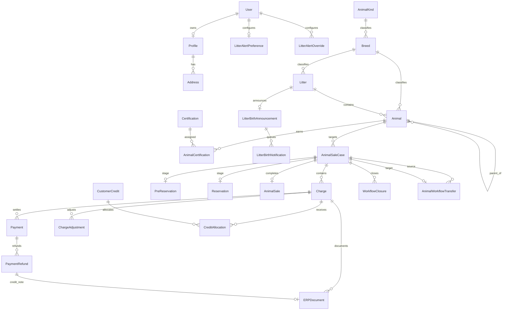

# Domain model

## Conventions

This document describes durable data and ownership. Detailed transition rules
for commercial models are in [Commercial workflows](commercial-workflows.md).

The project follows these conventions:

- integer primary keys are internal unless a model exposes a UUID `public_id`;
- public UUIDs are safe references for customer commercial URLs;
- `created_at` records creation and `updated_at` records the latest mutation;
- nullable foreign keys plus snapshot fields preserve historical records after
  a public target is removed;
- translated fields are expanded by `django-modeltranslation`;
- `PROTECT` is used where deletion would corrupt contractual or financial
  history;
- generic relations are limited to reusable attachments, tags, and blog likes;
- model `order` fields control editorial ordering, not chronological history.

## High-level relationships



## `accounts`

### Django `User`

Django's built-in user is the identity source. The application uses:

- `username` and `email` for registration and login-related communication;
- `first_name` and `last_name` for customer defaults;
- `is_active` to enforce email activation;
- `is_staff` and model permissions for Django admin;
- Django password hashing, token generation, and session management.

Deleting a user with commercial history is blocked by protected relationships.

### `Profile`

One profile extends one user with:

| Field | Purpose |
| --- | --- |
| `birthdate` | Optional date and derived `age` |
| `fiscal_number` | Default fiscal identity |
| `phone` | Contact number |
| `profile_picture` | Optional customer media |

Registration creates the profile in the same transaction as the inactive user.
The profile view also repairs an older user that has no profile.

### `Address`

An address belongs to a profile and stores street lines, city,
state/province, postal code, country, billing/shipping kind, and default flag.
Commercial records copy billing data into snapshots; changing an address does
not rewrite a past purchase.

## `breeding`

### `AnimalKind`

An animal kind is a database category such as dog. It has a translated name and
editorial order. Chat uses all translated values as canonical search terms.
Adding another kind does not require a new chat enum member.

### `Breed`

A breed belongs to an animal kind and may have a parent breed. It stores:

- translated name and description;
- cover image;
- `featured` for homepage/navigation promotion;
- `active` for public visibility;
- editorial order.

The `(kind, name)` pair is unique. `objects_specific` excludes parent
categories; the featured variant also restricts to active, featured records.
Animals, litters, certifications, quiz weights, promotions, and alert
preferences may reference breeds.

### `Certification`

A certification stores a unique short `code`, translated name and description,
optional parent, applicable breeds, and order. `AnimalCertification` is the
through model that adds assignment date and display order for one dog.

### `Animal`

`Animal` represents an individual dog in the current product. Important field
groups are:

| Group | Fields and meaning |
| --- | --- |
| Identity | breed, name, translated description, birth date, gender, hair type |
| Lineage | father, mother, source litter |
| Evidence | certifications, generic attachments, generic tags |
| Catalogue | active, order, training, breeding, for sale |
| Public price | asking price and optional direct discount |
| Final state | sold date and optional customer |
| Pre-reservation | enabled flag and fee |
| Reservation | deposit percentage and offer-validity hours |

`current_price_in_euros` returns no price when the dog is not for sale. When it
is for sale, it returns asking price minus direct dog discount. A dog discount
requires a price and cannot exceed it.

The commercial price is snapshotted when a sale case starts. `price_in_euros`
remains the current public asking price; `AnimalSale.final_price` is the audited
final sale amount.

The image attachment with the lowest order is the cover. Media and tags are
generic records rather than columns on `Animal`.

### `Litter`

A litter stores:

- breed, translated name/description, father, and mother;
- expected birth date, ready date, and baby count;
- actual birth date, ready date, and baby count;
- lifecycle status: expecting, born, ready, or completed;
- active and editorial-order flags;
- values copied to generated dogs: pre-reservation enabled, fee, and reservation
  deposit percentage;
- generic attachments and tags.

Litters cannot be pre-reserved or reserved. They are public catalogue and
notification subjects. The admin generation action creates only the missing
number of individual animals after an actual birth and copies the configured
offspring values, translated description, attachments, and tags.

### `LitterAlertPreference`

One record per user stores a general notification policy:

| Scope | Meaning |
| --- | --- |
| `none` | No general birth alerts |
| `all` | Birth alerts for all breeds |
| `selected_breeds` | Birth alerts only for selected breeds |

The record also stores the preferred language. The selected breeds M2M is
meaningful only for `selected_breeds`.

### `LitterAlertOverride`

An override is unique per `(user, litter)` and explicitly subscribes or
unsubscribes that user from that litter. It takes precedence over the general
preference.

### `LitterBirthAnnouncement`

One durable announcement is created for one litter when it becomes born with
an actual date and baby count. It snapshots litter name, breed name, count, and
date, allowing deliveries to remain meaningful after catalogue changes.

### `LitterBirthNotification`

One delivery record per `(announcement, user)` stores recipient, language,
status, attempt count, lease time, next retry, error, and sent time. It is a
durable queue item processed by the reservation scheduler.

## `reservations`

### Terms models

`PreReservationTerms` and `ReservationTerms` are intentionally separate. Each
has:

- a unique human version;
- translated description;
- optional publication timestamp.

The current version is the latest record whose publication time is not in the
future. Used terms are protected and become read-only in admin.

### `AnimalSaleCase`

The sale case is the aggregate root for one attempt to progress one dog through
the commercial lifecycle. It ties all stages and financial records together.

It stores:

- customer user when one exists;
- current animal relation;
- origin: online, staff, or transfer;
- aggregate status: pre-reservation, reservation, sold, closed, or transferred;
- immutable target, dog price, deposit, customer, billing, language, and
  currency snapshots;
- creator and closure timestamps.

A conditional unique constraint allows only one blocking pre-reservation,
reservation, or completed sale case per animal. Cancelled sales become closed
after their `AnimalSale` is voided; historical closed and transferred cases
remain without blocking the animal.

### `Charge`

One charge exists per `(sale case, stage)`. The stages are:

- pre-reservation;
- reservation;
- final sale.

A charge stores subtotal, immutable promotion snapshot, due time, currency,
status, creator, and void reason. It aggregates:

- `ChargeAdjustment`;
- `Payment`;
- `CreditAllocation`;
- fiscal documents.

Its computed values are:

```text
total = max(subtotal - promotion discount + signed adjustments, 0)
paid = successful real payments - successful refunds
credit = active customer-credit allocations
settled = paid + credit
amount due = max(total - settled, 0)
```

The status is open, partially paid, paid, or void. The ledger service refreshes
it from child records.

### `ChargeAdjustment`

An adjustment is an immutable signed amount with kind, reason, creator, and
timestamp. Kinds distinguish manual discount, surcharge, waiver, and
correction. Negative values reduce the charge; positive values increase it.
Zero is forbidden.

### `PreReservation`

The current public workflow supports individual dogs only. The model retains a
legacy litter target type and nullable litter relation so old history can still
be represented, but services reject new litter purchases.

The record stores:

- sale case and pre-reservation charge;
- customer and target relations plus snapshots;
- status and review/cancellation audit;
- fee, discount, total, dog-price/deposit, promotion, and currency snapshots;
- checkout hold deadline;
- exact terms, acceptance source, and acceptance time.

The database verifies non-negative values, discount not exceeding fee, and
`total = fee - discount`. A conditional unique constraint prevents two
capacity-consuming pre-reservations for one dog.

### `Reservation`

A reservation is the second commercial stage. It may be created from an
accepted pre-reservation or directly by staff. It stores:

- sale case, reservation charge, and optional source pre-reservation;
- offer state and deadline;
- deposit target;
- pre-reservation credit;
- customer credit;
- promotion and discount snapshot;
- remaining payment amount;
- terms acceptance;
- confirmation, expiry, and cancellation audit.

The database verifies:

```text
payment amount =
    deposit target
    - pre-reservation credit
    - customer credit
    - reservation promotion discount
```

### `Payment`

A payment belongs to a charge and, during compatibility migration, may also
point directly to the stage purchase. Providers are Stripe, cash, bank
transfer, card terminal, other, and complimentary.

It stores:

- amount, currency, provider, and status;
- Stripe Checkout Session, PaymentIntent, and Charge identifiers;
- checkout URL, start, expiry, and attempt number;
- Stripe fee/net reconciliation state;
- paid/failed timestamps and safe error;
- offline external reference, note, and recording staff user.

Multiple payment rows may settle a charge. Failed attempts remain as audit
history. Provider identifiers are unique.

### `PaymentRefund`

Each refund decision is durable and belongs to one payment. It may also point
to the closure or transfer that requested it. It stores:

- calculation type: fixed, target percentage, or full remaining;
- Stripe or manual processing method;
- exact amount and optional target percentage;
- Stripe fee/net snapshots and explicit loss acknowledgement;
- reason, requester, provider identifier, status, attempts, retry schedule,
  errors, and timestamps.

Committed refund amount includes pending, processing, and successful refunds,
so concurrent or retried requests cannot exceed the original payment.

### `WorkflowClosure`

A closure records why value stopped progressing at a stage:

- cancelled;
- rejected;
- expired;
- transferred.

It snapshots available settled value and its exact partition:

```text
available paid value = refund + customer credit + retained value
```

The database enforces the equation. The closure is the commercial decision;
refund and credit child records are the mechanisms that implement it.

### `CustomerCredit`

Credit represents value the business owes a customer for a later dog process.
It may originate from a closure or transfer and identifies either a registered
user or customer snapshot.

Status is active, exhausted, or void. Available value is original amount minus
non-reversed allocations.

### `CreditAllocation`

An allocation applies positive credit to a charge. It is never deleted or
overwritten. A reversal records timestamp, staff user, and reason, returning
the value to the source credit.

### `AnimalWorkflowTransfer`

A transfer links one source sale case to exactly one new target case. It stores
source/target stage, reason, staff user, and the exact partition:

```text
available source value = transferred + refunded + retained
```

The source history is closed as transferred. The target receives value through
customer-credit records and allocations, preserving an auditable money trail.

### `AnimalSale`

One final sale completes one sale case. It stores:

- final sale price, except when an imported legacy record did not contain it;
- sale date;
- final-stage charge, except for truthful legacy imports;
- operational notes;
- completing staff user.

The sale record itself is the sold-state authority. Its sale case identifies
the registered customer when one exists; `Animal` contains no duplicated sale
date or customer fields. A cancelled sale remains immutable and records
`voided_at`, `voided_by`, and `void_reason`; only non-voided sales make a dog
sold.

### `ERPDocument`

An ERP document is a durable integration job, not merely cached provider data.
Kinds are sale document and credit note. It stores:

- source charge/payment/refund;
- immutable amount and currency;
- stable unique external reference;
- local integration state and remote ID/number;
- uncertainty, lease, retry, error, and attempt data;
- independent PDF state, bytes, filename, digest, retries, and error.

One sale document is allowed per charge or legacy payment. One credit note is
allowed per refund.

### ERP audit models

`ERPIntegrationAttempt` records trigger, result, safe error, staff user, and
timing for every integration attempt.

`DocumentEmailAttempt` records recipient, sent/failed state, staff trigger, safe
error, and timestamps for PDF delivery attempts.

### `ProcessedStripeEvent`

One record per unique Stripe event ID provides webhook idempotency and records
event type, related payment when known, and processing time.

## `discounts`

### `Promotion`

A promotion stores:

| Dimension | Values |
| --- | --- |
| Discount type | Fixed EUR amount or percentage |
| Purchase stage | Pre-reservation, reservation, or both |
| Scope | Any dog, selected breeds, or selected dogs |
| Schedule | Optional start and end |
| Activation | Explicit active flag |
| Usage | Optional global and per-user redemption limits |

Codes are normalized to uppercase and compared case-insensitively by
normalization. A percentage cannot exceed 100, dates must be ordered, and the
quoted discount is capped at the current amount. A used promotion is protected
from deletion through charge/purchase foreign keys.

## `frontoffice`

### `FrequentlyAskedQuestion`

An FAQ stores translated question and answer, optional image, active flag, and
display order. Only active FAQs appear publicly and in chat. It also has a
derived `ChatSearchEntry` containing canonical translated questions and
reviewed aliases.

## `blog`

### `Category`

A translated category may have a parent, active flag, and display order.
`(name, parent)` is unique.

### `Post`

A post has author, translated title, cover, translated EditorJS JSON content,
categories, generic tags, generic likes, publication time, active flag, and
order. The public manager returns only active, published posts.

### `Comment`

A comment belongs to a user and post, may reply to another comment, records text
and timestamp, and supports generic likes.

### `Like`

A generic like links one user to one blog object. The combination of user,
content type, and object ID is unique.

## `quiz`

### `Question`

A translated question has a display order.

### `Answer`

A translated answer belongs to one question, has a display order, and links to
breeds through weighted associations.

### `AnswerWeight`

One unique `(answer, breed)` record assigns an integer score. Submitted answers
are summed by breed and the highest-scoring breed is returned.

## `attachments`

### `Attachment`

An attachment is a generic file related to any supported content object. It
stores:

- storage file;
- optional thumbnail;
- owning content type and object ID;
- translated description;
- original filename and detected MIME type;
- display order.

Video saves lazily import OpenCV and attempt to generate a WebP thumbnail from
the first frame. Failure is logged and does not discard the source file.

## `tags`

### `Tag`

A tag is generic to one object and stores translated label plus optional light
and dark theme colours. `(tag, content type, object ID)` is unique.

## `chat`

### `ChatModel`

A local model catalogue entry stores a model ID, display name, approved Hugging
Face repository, GGUF filename, revision, optional SHA-256 and size,
description, recommendation flag, and enabled flag.

The record validates repository and file rules before saving.

### `ChatModelConfiguration`

A singleton-like row points to the active enabled model. Runtime selection is
stored in the database so staff can change it without editing deployment
configuration.

### `ChatSearchEntry`

One generic search projection points to one registered public-domain object. It
stores:

- human label;
- generated canonical terms;
- staff-reviewed aliases, one per line;
- update timestamp.

The `(content type, object ID)` pair is unique. The projection is synchronized
by model signals or a rebuild command. Visibility is always checked again
through the registered public queryset.

## Translation-generated fields

`django-modeltranslation` creates language-specific database columns for
registered fields, including names, descriptions, FAQ content, blog content,
quiz content, tags, attachments, and terms.

Do not manually add fields such as `name_pt` to a model. Register the base field
in the app's `translation.py`, create the generated migration, translate the
messages/content, and test fallback behaviour.

## Generic-relation cautions

Generic relations are flexible but do not provide normal database foreign-key
integrity for the object ID. Follow these rules:

1. Create generic records only through the owning model/admin inline.
2. Do not reuse one `Attachment`, `Tag`, or `Like` for several objects.
3. Preserve content-type/object pairs during fixtures.
4. Test deletion behaviour for any new owning model.
5. Do not use generic relations for money, terms, customer identity, or other
   contractual history.
