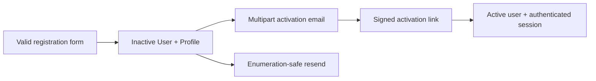

# Public site and administration

## URL and language conventions

Customer pages and Django admin are language-prefixed:

```text
/<language>/...
```

Supported language prefixes are `en`, `pt`, `es`, `fr`, `de`, and `it`.
Examples in this document omit the prefix unless it is relevant.

Machine endpoints such as Stripe webhooks and health checks are intentionally
not localized. See [Architecture](architecture.md#request-topology).

## Public navigation areas

The shared navigation exposes the kennel catalogue, available dogs, litters,
quiz, blog, contact information, account controls, and customer commercial
dashboard according to the current user state. Every page extends
`fortissimusbellator/templates/base.html`.

## Informational pages

| Route | View | Main data and behaviour |
| --- | --- | --- |
| `/` | `frontoffice.views.home` | Homepage with featured breed and kennel content |
| `/about-us/` | `frontoffice.views.about_us` | Kennel information and up to 50 randomly selected image attachments |
| `/faqs/` | `frontoffice.views.faqs` | Active FAQs in editorial order |
| `/contact-us/` | `frontoffice.views.contact_us` | reCAPTCHA-protected contact form and branded internal email |

The contact form validates name, email, phone, message, and reCAPTCHA. It sends
to `BUSINESS_NOTIFICATION_RECIPIENTS`, uses the submitted email as a reply
action, and never exposes SMTP errors to the visitor.

## Dog catalogue

### Our dogs

| Route | Access | Purpose |
| --- | --- | --- |
| `/our-dogs/` | Public | Active breeding dogs |
| `/our-dogs/<breed_id>/` | Public | Active breeding dogs filtered by breed |

The page uses `Animal.animals_for_breeding`, loads breed/kind and
certifications efficiently, and renders the configured editorial order.

### Dogs for sale

| Route | Access | Purpose |
| --- | --- | --- |
| `/buy-a-dog/` | Public | Filterable and paginated sales catalogue |
| `/buy-a-dog/<dog_id>/` | Public | Public dog detail |
| `/buy-a-dog/<dog_id>/pre_reserve` | Authenticated | Pre-reservation checkout |

The list supports filters for:

- breed;
- gender;
- hair type;
- age group;
- training;
- certifications.

Cards are progressively loaded through the `X-Load-More` partial response.
Every catalogue query is annotated by
`reservations.availability.annotate_dog_availability`.

### Public lifecycle badge

Only one commercial badge is rendered for a dog, in this priority:

1. **Sold**, when a non-voided `AnimalSale` exists.
2. **Reserved**, when a confirmed reservation blocks the dog.
3. **Pre-reserved**, for any other active sale case holding the dog.

The associated dog image receives the unavailable grayscale treatment in all
three states. A badge is display text, not a link or button.

`for_sale` is not changed merely because a dog is held. It continues to
describe the dog's catalogue purpose. Availability is a separate calculated
fact.

### Price and action rules

- A dog with no published positive price shows price on request.
- A dog without a positive published price cannot be pre-reserved online.
- A sold, reserved, or pre-reserved dog has no public pre-reservation action.
- A dog whose `pre_reservation_enabled` is false has no online action.
- The detail page does not present “contact us to reserve” as an alternative
  action when the dog is already held.
- Server-side validation repeats every rule even if the template hides the
  action.

## Litter catalogue and alerts

| Route | Access | Purpose |
| --- | --- | --- |
| `/upcoming-litters/` | Public | Active litter list with breed filter and pagination |
| `/upcoming-litters/<litter_id>/` | Public | Litter detail and alert state |
| `/upcoming-litters/<litter_id>/alerts/subscribe/` | Authenticated POST | Explicit per-litter subscription |
| `/upcoming-litters/<litter_id>/alerts/unsubscribe/` | Authenticated POST | Explicit per-litter opt-out |

Litters do not expose pre-reservation or reservation checkout. The customer
subscribes for a birth email, then chooses an individual dog after staff creates
and publishes it.

An explicit litter subscription or opt-out overrides general alert settings.
The detail view recomputes the effective subscription from both sources.

## Customer accounts

| Route | Access | Purpose |
| --- | --- | --- |
| `/register/` | Anonymous | Create inactive user and profile |
| `/email-confirmation-sent/` | Public | Neutral delivery instructions |
| `/resend-activation-email/` | Public | Enumeration-safe resend |
| `/activate/<uid>/<token>/` | Signed token | Activate and sign in |
| `/login/` | Anonymous | Django login |
| `/logout/` | Authenticated POST/flow | End session |
| `/welcome/` | Authenticated | Post-login destination |
| `/profile/` | Authenticated | User/profile and billing defaults |
| `/profile/litter-alerts/` | Authenticated | General and per-litter alert settings |
| `/change-password/` | Authenticated | Change password while preserving session |
| `/password-reset/` | Public | Request signed reset email |
| `/password-reset-confirm/<uid>/<token>/` | Signed token | Set new password |

### Registration lifecycle



If initial email delivery fails, the inactive account remains and can use
resend. The resend page returns the same response for known and unknown email
addresses.

The activation and password-reset links use the request host/protocol. Other
commercial and scheduler emails use `PUBLIC_SITE_URL`.

## Customer commercial dashboard

| Route | Access | Purpose |
| --- | --- | --- |
| `/my-reservations/` | Authenticated | Active cases, history, charges, payments, refunds, credits, and documents |
| `/my-reservations/pre-reservations/<uuid>/retry-payment/` | Owner POST | Resume or retry pre-reservation checkout |
| `/my-reservations/pre-reservations/<uuid>/cancel/` | Owner GET/POST | Confirm and cancel an eligible pre-reservation |
| `/my-reservations/reservations/<uuid>/checkout/` | Owner | Accept terms and pay an offered reservation |
| `/my-reservations/reservations/<uuid>/retry-payment/` | Owner POST | Retry reservation payment within its offer |
| `/my-reservations/documents/<id>/download/` | Owner GET | Download an available fiscal PDF |
| `/my-reservations/documents/<id>/retry-pdf/` | Owner POST | Retry missing PDF retrieval |

Confirmation and payment-cancelled pages are also owner-bound through the
public purchase UUID. Payment success is reconciled server-side.

### Dashboard content

The dashboard groups sale cases into active and history, while preserving:

- target snapshot and current dog link when still public;
- primary dog image;
- pre-reservation, reservation, sale, closure, and transfer states;
- every stage charge and immutable adjustment;
- promotion code and discount snapshot;
- real payments, provider, failed attempts, and refund state;
- customer-credit allocations;
- fiscal-document status and PDF action;
- cancellation, rejection, expiry, and retained/refunded/credited values.

Disabled or deleted public dogs remain visible through their snapshots. The
dashboard does not require the target to remain for sale.

The customer may cancel a pre-reservation only before breeder acceptance.
Customers cannot cancel reservations online.

## Terms pages

| Route | Access | Data |
| --- | --- | --- |
| `/pre-reservation-terms/` | Public | Current published pre-reservation terms |
| `/reservation-terms/` | Public | Current published reservation terms |

Checkout embeds the exact current terms and requires explicit acceptance. A
terms page returns 404 if no version is published.

## Blog

| Route | Access | Purpose |
| --- | --- | --- |
| `/blog/` | Public | Active published posts with progressive pagination |
| `/blog/posts/<post_id>/` | Public | Post and up to four posts sharing categories |

Only the published manager is used. Unpublished or inactive posts are not
accessible by guessing an ID. Blog content is structured EditorJS JSON rendered
by the template.

## Breed quiz

| Route | Access | Purpose |
| --- | --- | --- |
| `/quiz/` | Public | Show all ordered questions and calculate a breed match |

Each answer contributes configured integer weights to breeds. The highest total
is rendered as the result. Quiz results are advisory catalogue navigation, not
a commercial eligibility decision.

## Chat widget

The widget is included globally and POSTs to `/chat/message/`. Detail pages can
add an allow-listed hidden context record containing public IDs and labels.

Conversation turns and the last unambiguous entity remain in browser
`sessionStorage` for the current tab/session. There is no chat-history page and
no server-side conversation model.

See [Chat architecture](chat.md).

## Machine and staff utility endpoints

| Route | Access | Purpose |
| --- | --- | --- |
| `/webhooks/stripe/` | Verified Stripe signature | Payment/refund events |
| `/health/live/` | Public infrastructure probe | Process liveness |
| `/health/ready/` | Public infrastructure probe | Database readiness |
| `/upload/` | Staff | Chunked general upload |
| `/editorjs/image/upload/file/` | Staff | Validated EditorJS image upload |
| `/editorjs/image/upload/url/` | Staff | Validated public remote-image ingestion |
| `/<language>/admin/chat/model-status/` | Staff | Local model selection and lifecycle |
| `/chat/model-status/` | Staff | Legacy model-status bookmark |

## Django admin overview

The admin is the operational back office. Model permissions remain Django's
standard add/change/delete/view permissions. Custom workflow views repeat the
permission checks and use confirmation forms for consequential actions.

### Accounts

`Profile` and `Address` are available for customer support and correction.
Django's standard `User` admin remains the identity and permission interface.

### Breeding catalogue

| Entity | Main admin capabilities |
| --- | --- |
| Animal kind | Translation, order, chat aliases, AI alias suggestions |
| Breed | Translation, active/featured filters, parent autocomplete, chat aliases |
| Certification | Translation, breed relationships, parent autocomplete, chat aliases |
| Animal | Search/filter catalogue, parent and litter autocomplete, certification/media/tag inlines, commercial configuration, social publishing |
| Litter | Search/filter lifecycle, parent autocomplete, media/tag inlines, generate missing animals, social publishing |

Father, mother, and other large relationships use Django autocomplete where
configured. Search results are alphabetical and server-paginated rather than
rendering the entire dog table as one select.

#### Generate animals from litter

The action:

1. requires actual birth date and baby count;
2. calculates `babies - existing generated animals`;
3. refuses to generate beyond the actual count;
4. creates only the missing individual records;
5. copies breed, parents, birth date, translated description, offspring
   pre-reservation configuration, attachments, and tags.

The generated records still require staff review of identity, gender, public
price, sale visibility, and media before publication.

#### Catalogue deletion

Bulk delete is removed from reservation-aware targets. Deleting an animal with
pre-reservation history requires a second explicit warning. Snapshot signals
record target deletion time before the foreign key is cleared. Financial and
contractual records are not deleted.

### Litter alerts

| Entity | Purpose |
| --- | --- |
| Litter alert preference | Inspect a user's general scope and language |
| Litter alert override | Inspect explicit litter subscription/opt-out |
| Birth announcement | Read-only durable event |
| Birth notification | Delivery status, retries, error, and manual retry action |

Announcements and notification history are protected from routine deletion.

### Commercial operations

#### Animal sale process

The `AnimalSaleCase` admin is the entry point for staff-created business:

- create a pre-reservation;
- create a reservation directly;
- record a final sale directly;
- choose a registered customer or customer snapshot;
- override the current stage amount;
- record terms accepted in person;
- record cash, bank transfer, card terminal, other offline payment, or leave
  Stripe payment for the customer;
- explicitly record a complimentary zero-value stage with a mandatory audit
  note;
- apply eligible customer credit;
- transfer an active process to another available dog;
- complete an existing pre-reservation/reservation as a final sale.

The selected business stage determines which specialised model and charge are
created. Staff must not create synthetic earlier stages merely to reach a later
one.

Use `Reservations > Animal sale processes > Add`. A paid or complimentary
staff-created pre-reservation is auto-accepted because its creation already
records the breeder's decision; it immediately creates the time-limited
reservation offer. A Stripe pre-reservation remains pending while the customer
accepts its terms and pays, then auto-accepts after verified payment. Direct
Stripe reservations and pre-reservations send the customer a branded link to
continue the same process.

Every process change page links directly to its charges and specialised
pre-reservation/reservation records. The charge actions support partial or full
offline payment, customer terms recorded outside the website, and immutable
discount, waiver, surcharge, or correction entries. Settling a balance through
payment, credit, or adjustment advances the state atomically.

#### Pre-reservation

The changelist includes grouped status filters, payment state, reservation
state, ERP state, customer, target, and compact badges.

Available actions:

- accept a paid case awaiting review;
- reject it with a reason and explicit value split;
- cancel an eligible case with a reason and explicit value split;
- inspect exact terms and immutable snapshots;
- follow the resulting reservation, payments, refunds, credits, transfer, and
  documents.

Acceptance creates an offer; it does not mark the reservation paid.

#### Reservation

The reservation admin shows offer deadline, payment, pre-reservation source,
terms, and current state. Only staff can cancel. Cancellation requires a
reason and an explicit split of all available pre-reservation and reservation
value into:

- refund;
- customer credit;
- retained amount.

The resulting email and dashboard use reservation-specific wording.

#### Charge and adjustment

The charge screen is the financial source of truth. Staff can:

- record a verified offline payment;
- add a signed adjustment with reason;
- inspect real payments, credits, refunds, promotion, total, settled value, and
  amount due.

Settled payment rows are never edited into a different payment. Corrections use
new adjustments, refunds, reversals, or payments.

#### Payment and refund

The payment screen shows provider identifiers, attempts, fee/net values,
refunds, and ERP records. Staff may request an eligible fixed, cumulative
percentage, or full remaining refund.

Refund requests display whether provider cost data is known and require
explicit acknowledgement before a refund can exceed known retained net or when
loss cannot be calculated.

Manual-provider refunds are recorded as manual outcomes. Stripe refunds are
queued and can be retried from the refund changelist.

#### Credit

Customer-credit and allocation screens expose original value, available value,
source, target charge, and reversals. These are audit views. Allocation and
reversal should normally occur through a sale workflow rather than manual
model editing.

#### Transfer

The transfer form requires:

- a different available target dog;
- reason;
- exact source split into transfer, refund, and retained value;
- target-stage amount when it differs from the target default;
- terms handling;
- provider for any positive difference;
- Stripe-loss acknowledgement when applicable.

The source becomes historical and the new target case becomes the active
process.

#### Final sale

Completing a sale records final price and date, applies earlier settled value,
optional customer credit, and final payment, then sets the dog as sold. Existing
unreconciled online payments must be closed first. If earlier settled value
exceeds final price, staff must resolve the excess before completion.

Completed sales expose a dedicated **Cancel completed sale** operation. Staff
must choose the refund, customer-credit, and retained-value outcome. The
original sale remains read-only, the customer is notified, and any refund
continues through the normal fiscal credit-note workflow.

### Terms

Pre-reservation and reservation terms admin:

- allows draft creation;
- makes a version effective by setting `published_at`;
- selects the newest effective version at checkout;
- makes a used version read-only;
- forbids deletion when referenced.

Publish a new version instead of editing contractual history.

### Promotions

Promotion admin exposes active state, purchase stage, discount type, scope,
schedule, usage limits, selected breeds, and selected dogs.

Validation requires scope fields to match the selected scope. Used promotions
cannot be deleted because commercial snapshots and protected foreign keys must
remain.

### ERP documents

The ERP changelist separates:

- deferred;
- pending/processing;
- retryable failure;
- needs attention;
- integrated;
- PDF pending/failed/available.

Staff can:

- confirm and retry integration;
- retry PDF retrieval;
- download an available PDF;
- resend the PDF to the customer;
- inspect integration and email attempts.

An uncertain creation must be reconciled by stable external reference before a
new provider create is attempted.

### Chat administration

Staff can:

- manage approved local model catalogue entries;
- choose, download, verify, load, retry, or update the active model;
- edit aliases beside supported domain records;
- request AI alias suggestions for a saved record;
- review suggestions in the browser before saving;
- rebuild the central index with a management command.

Alias generation never saves automatically and never blocks ordinary admin
editing if the local model is unavailable.

### Editorial administration

| Area | Admin capabilities |
| --- | --- |
| FAQs | Translated question/answer, image, active/order, chat aliases |
| Blog categories | Translation, parent, active/order |
| Blog posts | Author, cover, translated EditorJS content, publication, categories/tags |
| Quiz | Ordered translated questions/answers and inline breed weights |
| Attachments/tags | Generic inlines on owning records |

## Admin safety rules

1. Never infer a state change from a badge or manually edit related status
   fields to “make the screen look right”.
2. Use the custom action or service-backed form for commercial changes.
3. Reconcile pending provider operations before cancellation, transfer, or
   sale completion.
4. Never delete financial, terms, Stripe-event, ERP-attempt, closure, transfer,
   or email-attempt history.
5. Use a new adjustment, payment, refund, credit, or terms version instead of
   rewriting an audited record.
6. Check the customer email and language snapshot before sending documents.
7. Use list filters to isolate failures; do not treat all non-success states as
   the same failure.
